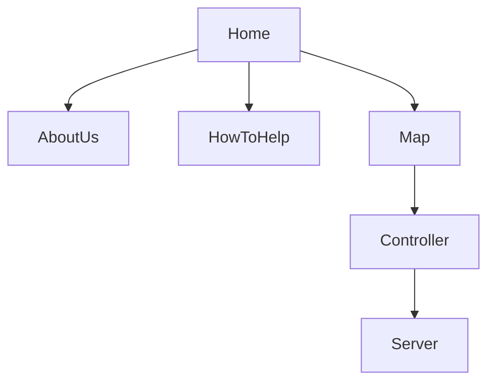

# SafeFishing
 Proyecto para el Hackathon Hack The Ocean | [Launch X](https://github.com/LaunchX-InnovaccionVirtual)
 
 
 

# Descripcion

Investigación en la que se identifican las principales especies marinas de pesca en méxico, con fines de consumo o deportivo, las zonas en las que suelen frecuentar y sus temporadas de veda registradas de forma interactiva en un mapa donde al dar click en los estados de las zonas costeras se identifica la especie y su información para informar al usuario si está o no en temporada de veda, y las fechas de la misma.

### [Requerimientos](https://github.com/Ange1D/SafeFishing/blob/main/Requerimientos.pdf).

### BuyerPersona

 
 
### Público Objetivo
 
 
 
## Resumen
 
 México cuenta con más de 11 mil kilómetros de litorales donde podemos pescar, contamos con el 12 por ciento de la biodiversidad mundial y en los mares mexicanos habitan 2 mil especies endémicas. En los litorales mexicanos se capturan más de 2 millones de toneladas de peces, y una de las actividades deportivas favoritas en Los Cabos y toda la Baja California es la pesca deportiva.
 
 La veda es una temporada en la que se prohíbe el consumo y explotación de determinadas especies, Con la finalidad de evitar que sean explotadas en su época de reproducción o desarrollo. Así, la población se recupera y la pesca o caza puede continuar sin poner en peligro a los animales. Es importante respetar las temporadas de veda para asegurarnos de no agotar las especies marinas. 

Por lo que en este proyecto se realiza un mapa interactivo enfocado en las costas de México (Golfo, Pacifico norte y pacífico sur) con filtros de animales marinos que se suelen pescar en esas regiones y un indicador de colores que identifiquen las temporadas de veda de dichas especies para evitar su pesca.

## WIREFRAME

## Instalacion

* Clonar el repositorio
* Instalar dependencias de Node.js con `npm install`
* Iniciar el poyecto con `npm start`

#### Dependencias

Proyecto realizado con [Angular 13](https://angular.io/), [Angular Material](https://material.angular.io/), [Bootstrap](https://getbootstrap.com/) y [TypeScript](https://www.typescriptlang.org/) implementando Github Actions para verificar los Test y realizar su deploy en github pages

[Repositorio del API](https://github.com/Ange1D/SafeFishing-API).

 # Demo
[SafeFishing](https://ange1d.github.io/SafeFishing).

- To do: 
  - Agregar más países.
  - Agregar imágenes de las especies.

## Autores:

- [Ange1D](https://github.com/Ange1D).

- [EAleman8](https://github.com/EAleman8).

- [porfirioclv](https://github.com/porfirioclv).

- [ahranza](https://github.com/ahranza).
